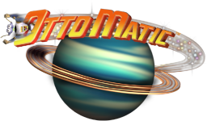
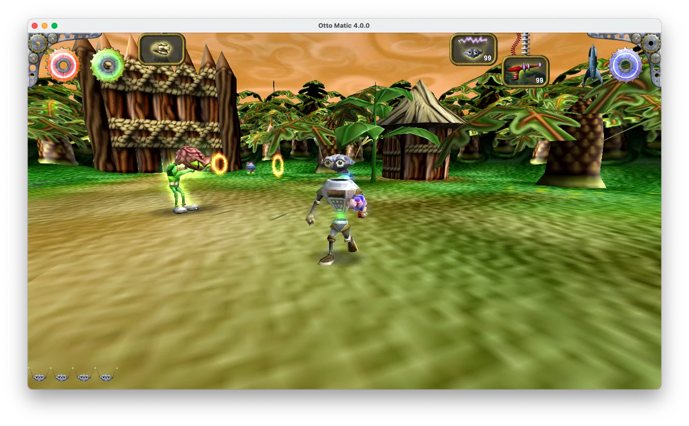

 
# Otto Matic

This is Pangea Software’s **Otto Matic** updated to run on modern desktop platforms.
 
**Get builds for macOS, Windows and Linux here:** https://github.com/jorio/ottomatic/releases

## The story 
 
The year is 1957 and a fleet of flying saucers from Planet X have come to Earth. These saucers are under the control of the evil Brain Aliens who are abducting helpless human beings to become slaves of The Giant Brain.
 
You are Otto Matic, the robot who is given the job of saving Earth from the clutches of The Giant Brain from Planet X. You must rescue as many humans as you can while defeating the Brain Aliens and all of their evil followers. Your mission will take you to strange and fantastic alien worlds which are often treacherous and will require Otto to perform amazing feats.

## About this update

Otto Matic was first released in 2001 as a "Carbon" app for Mac OS 9 and X. It came bundled with some Mac models of that era. The game was eventually ported to 32-bit Intel Macs, but it stopped working when macOS 10.15 discontinued 32-bit support, and with it, support for Carbon.

Pangea Software allowed me to update the original game to keep it running on today's major desktop platforms.

This update aims to be faithful to the original. Elements of the presentation and handling were slightly updated.

## Credits

- Programming and Game Design: Brian Greenstone
- Art and Game Design: Duncan Knarr
- Music: Aleksander Dimitrijevic
- Additional programming: Iliyas Jorio

## License

Otto Matic is being re-released here (https://github.com/jorio/ottomatic) under the [CC BY-NC-SA 4.0 license](LICENSE.md) with permission from Pangea Software, Inc.

© 2001 Pangea Software, Inc. Otto Matic is a trademark of Pangea Software, Inc. Portions © 2021 Iliyas Jorio.

## Other Pangea game ports

If you like games by Pangea Software, you might enjoy my other ports:

- [Billy Frontier](https://github.com/jorio/BillyFrontier)
- [Bugdom](https://github.com/jorio/Bugdom)
- [Cro-Mag Rally](https://github.com/jorio/CroMagRally)
- [Mighty Mike (Power Pete)](https://github.com/jorio/MightyMike)
- [Nanosaur](https://github.com/jorio/Nanosaur)
- [Nanosaur II](https://github.com/jorio/Nanosaur2)
- [Otto Matic](https://github.com/jorio/OttoMatic)
